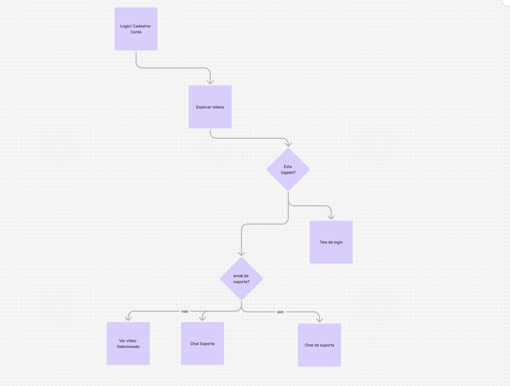
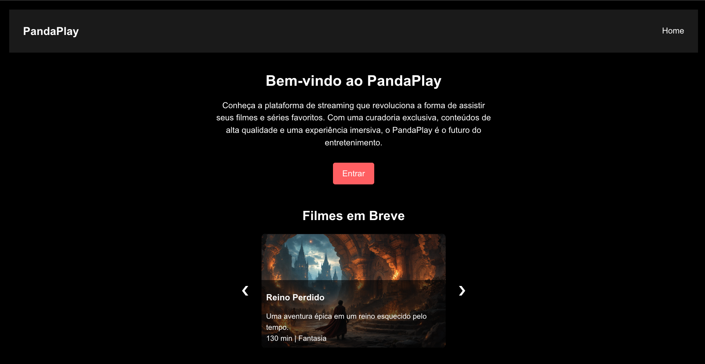
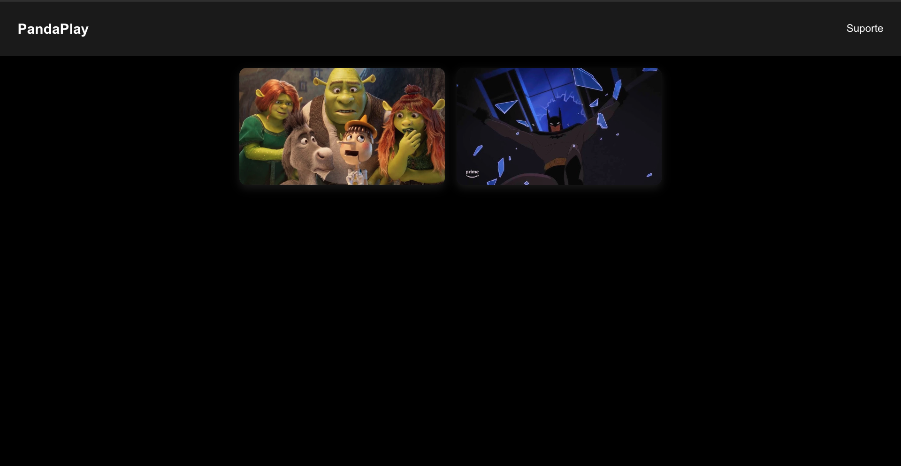
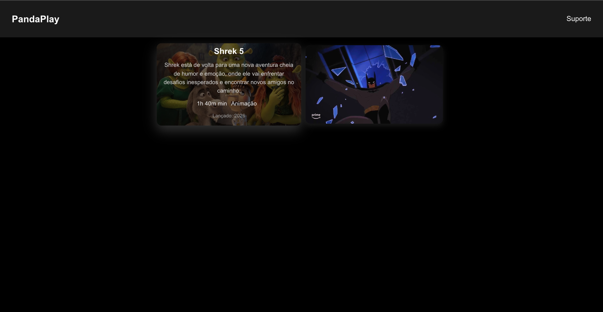
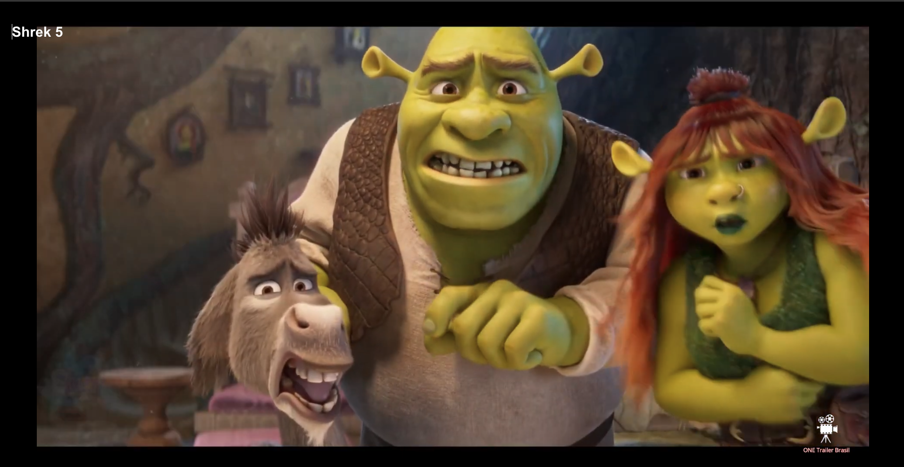
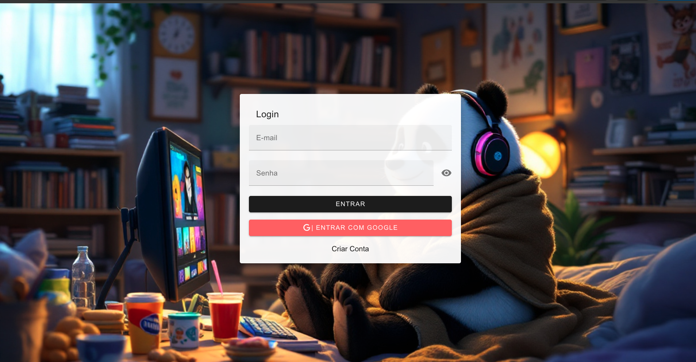
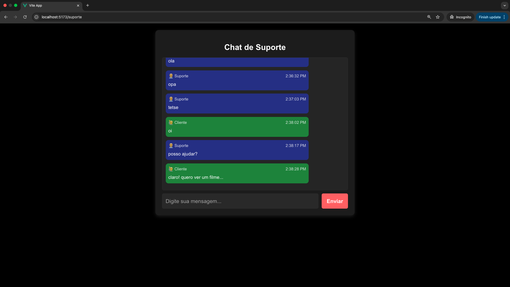
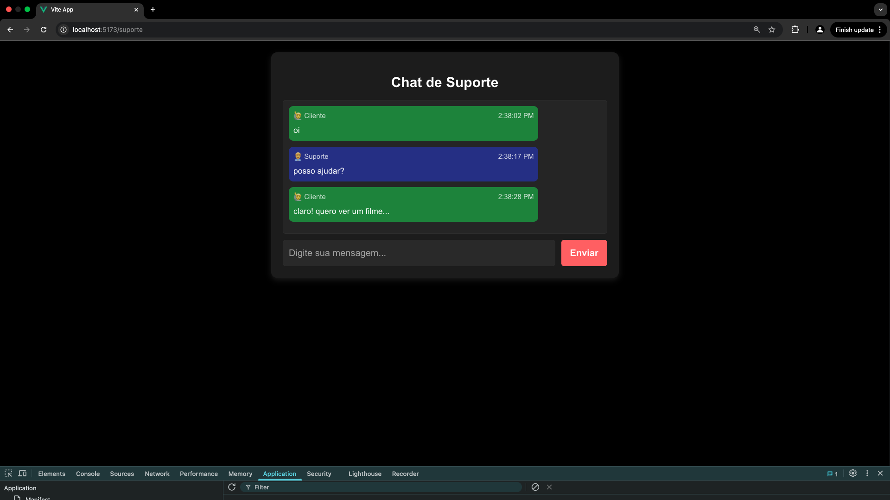

# pandaplay-frontend

## 📌 Requisitos

- Node.js v18+
- NPM ou Yarn
- Excute o backend localmente https://github.com/pedroHenriqueMaia/pandaplay-backend

## 🔧 Instalação

1. Clone este repositório:
   ```sh
   git clone https://github.com/seu-usuario/seu-repositorio.git
   ```

2. Acesse o diretório do projeto:
   ```sh
   cd nome-do-projeto
   ```

3. Instale as dependências:
   ```sh
   npm install
   # ou
   yarn install
   ```

## ▶️ Executando o Projeto

Para iniciar o servidor de desenvolvimento, execute:
```sh
npm run dev
# ou
yarn dev
```

A aplicação estará disponível em: [http://localhost:5173](http://localhost:5173) (ou a porta que o Vue/Vite disponibilizar).

## 🔑 Autenticação

### Login com Google (Auth0)

1. Clique no botão "Entrar com Google"
2. Escolha uma conta do Gmail e faça login

### Login com E-mail e Senha

Para testar o login com credenciais fixas, utilize:
- **Usuário comum:**
  - E-mail: `pedro.maia@gmail.com`
  - Senha: `teste123`
- **Usuário de suporte (para testar o chat):**
  - E-mail: `pedro@suporte.com`
  - Senha: `teste123`

## 📄 Tecnologias Utilizadas

- Vue.js
- Vue Router
- Vuetify
- Axios
- Auth0
- Node.js (Backend para autenticação e suporte ao chat)

## Mapa de Site UX

 

## Webpages do projeto


 
 
 
 
 
 


